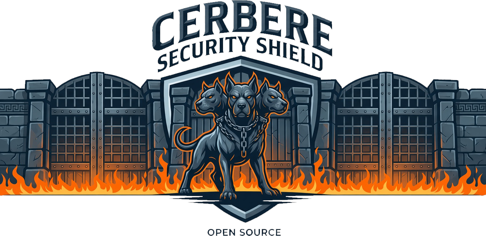

<p align="center">
  
</p>

<p align="center">
  
  
  
  
  
</p>

---

## 🛡️ Présentation

**Cerbere Security Shield** est une suite logicielle Windows autonome dédiée à la **sécurité périmétrique du poste**, à la **surveillance active des flux réseau** et à l'**évaluation de la réputation des exécutables**.

Conçu comme une alternative plus légère, transparente et directe à des solutions comme *GlassWire* ou *Portmaster*, Cerbere Security Shield opère sur des principes stricts :
- 🔒 **100% Local & Zéro Télémétrie** : aucune donnée personnelle, aucun paquet réseau et aucune liste de processus ne quittent votre machine.
- 🚫 **Fonctionnement sans compte ni abonnement** : l'application est pleinement utilisable hors ligne dès l'installation ; seule la vérification de réputation *optionnelle* demande une Auth-Key abuse.ch gratuite (`MALWAREBAZAAR_API_KEY`).
- ⚡ **Ultra Réactif & Non Intrusif** : scans système en microsecondes (`psutil.net_connections`), interface Web moderne (FastAPI) et client Systray Windows discret.
- 🛡️ **Protection Défensive Réversible** : durcissement natif via le Pare-feu Windows (`netsh` / PowerShell) sans perturber le trafic réseau légitime.

---

## ✨ Fonctionnalités à jour

### 1. 📊 Dashboard Ports & Processus en Temps Réel
- **Cartographie complète des sockets** : détection instantanée de tous les ports TCP et UDP en écoute ou connectés (`0.0.0.0`, `127.0.0.1`, interfaces LAN/WAN).
- **Corrélation native Port ↔ PID ↔ Exécutable** : identification du PID, du nom de binaire, de l'utilisateur propriétaire, du chemin absolu sur disque et des arguments complets de commande (`cmdline`).
- **Évaluation dynamique du risque** : calcul continu d'un score de risque (0 à 100) par port et au global, avec distinction nette entre processus système autorisés, services attendus et binaires inconnus/exposés.
- **Recherche & filtres instantanés** : filtrage en direct par nom de processus, numéro de port, protocole ou niveau de criticité.

### 2. 🚨 Détection d'Intrusion & Bannissement Pare-feu Persistant
- **Surveillance des journaux Windows** : analyse en continu des journaux d'événements de sécurité (Event IDs 4625 pour échecs d'authentification RDP/SMB, 4624, etc.).
- **Bannissement automatique persistant** : blocage immédiat des adresses IP hostiles récidivistes via des règles dédiées du Pare-feu Windows (`Cerbere_Intrusion_Ban_*`), synchronisées avec la base SQLite locale.
- **Gestion des bannissements** : expiration automatique configurable, possibilité de révocation manuelle en 1 clic et liste blanche d'IP de confiance.

### 3. 🔍 Réputation SHA-256 MalwareBazaar & Enquêtes 1-Clic
- **Analyse locale SHA-256** : calcul instantané et sécurisé de l'empreinte cryptographique de n'importe quel binaire actif sans jamais téléverser le fichier.
- **Vérification automatique MalwareBazaar (abuse.ch)** : interrogation automatisée de l'API gratuite MalwareBazaar pour vérifier si le hash est répertorié comme malveillant (trojan, ransomware, miner). Depuis 2024, abuse.ch exige une **Auth-Key gratuite** liée à un compte — créez-la sur https://abuse.ch puis définissez la variable d'environnement `MALWAREBAZAAR_API_KEY` (la même clé couvre aussi URLhaus, utilisé par l'enrichissement de domaines). Sans clé, ces vérifications externes passent en fail-open silencieux.
- **Cache SQLite de réputation** : rétention locale des verdicts pendant 7 jours (`reputation_cache.sqlite`) pour une réactivité instantanée et zéro surcharge réseau.
- **Liens d'investigation 1-clic** : boutons d'accès direct vers les plateformes de renseignement sur les menaces :
  - **VirusTotal** (recherche par hash SHA-256)
  - **ProcessLibrary** (encyclopédie des processus Windows)
  - **SpeedGuide** (base mondiale des numéros de ports et chevaux de Troie associés)
  - **SANS Internet Storm Center (ISC)**
  - **ShieldsUP (GRC)** (test externe : vos ports vus depuis Internet)

### 4. 🛑 Bloqueur de pub & trackers multi-listes & Sinkhole DNS
- **Interception DNS locale via WinDivert** : interception bas-niveau des requêtes DNS (UDP 53) au niveau de l'OS via le driver signé `WinDivert` et `pydivert`.
- **Blocage par Sinkhole (`0.0.0.0`)** : neutralisation instantanée des domaines publicitaires, télémétries et trackers pour toutes les applications de la machine sans proxy local lourd.
- **Listes EasyList & EasyPrivacy** : intégration et parsing des listes communautaires de référence avec mises à jour automatisées.
- **Bloqueur multi-listes** : listes cochables EasyList / EasyPrivacy / AdGuard DNS Filter / OISD / HaGeZi DNS Blocklists — toutes téléchargées à l'exécution (jamais redistribuées, conformément à leurs licences GPLv3), avec mise à jour automatique au démarrage et quotidienne, plus un bouton « Tout mettre à jour » dans Paramètres.
- **Whitelist intégrée & Allowlist communautaire** : liste blanche par défaut de **88 domaines essentiels** (mises à jour Windows, services cloud légitimes, CDN majeurs) pour garantir un fonctionnement sans faux positifs, complétable à tout moment par l'utilisateur.
- **Autorisation réversible** : « Autoriser » débloque un domaine immédiatement ; le bouton devient « Re-bloquer » pour annuler l'autorisation en un clic. « Réinitialiser DNS » restaure la whitelist par défaut.
- **Analyse IA intégrée** : chaque ligne des journaux propose 🔎 (fiche détaillée) et 🤖 (copie prête à coller dans une IA, avec feedback visuel) ; un bouton « 🤖 Tout analyser » exporte le journal complet en un clic.

### 5. ⚠️ Alertes de Sécurité avec Suppression & Inspection 1-Clic
- **Détection des anomalies de processus** : génération d'alertes lorsqu'un binaire inattendu ou script (`cmd.exe`, `powershell.exe`, exécutable temporaire) se met en écoute sur un port sensible.
- **Gestion du journal d'alertes** : panneau d'alertes consultable dans le dashboard avec bouton de suppression manuelle par alerte.
- **Inspection in-place** : développement d'un panneau d'information en 1 clic sur chaque alerte affichant son hash, sa réputation et ses raccourcis d'investigation.

### 6. 💻 Client Systray & Notifications Windows Discrètes
- **Icône dynamique en zone de notification** : statut visuel instantané du niveau de protection (Vert = Actif, Orange = Désactivé, Rouge = Incident).
- **Notifications discrètes (`BalloonTip`)** : alertes Windows natives non intrusives lors de la détection d'une menace critique ou d'un bannissement IP.
- **Menu contextuel rapide** : activation/désactivation de la protection globale, bascule du filtrage DNS, ouverture du dashboard web ou arrêt propre en un clic droit.

### 7. �‍👧 Contrôle Parental (PIN + fenêtres horaires + quotas)
- **PIN parental dédié** (4-8 chiffres, PBKDF2 + anti brute-force) : indépendant du mot de passe d'accès — requis pour activer/désactiver, modifier les règles ou arrêter complètement l'application.
- **3 modes de règles** par catégorie ou domaine : `Interdit` (sinkhole permanent), `Fenêtre horaire` (ex. TikTok uniquement 17h-19h), `Quota quotidien` (ex. 2h/jour — approximation par activité DNS, reset à minuit).
- **Catégories gratuites** (Blocklist Project, licence Unlicense) : adulte, jeux d'argent, drogues, arnaques, malwares, réseaux sociaux par plateforme.
- **Quitter en surface** : si la protection est active, « Quitter » dans le systray exige le PIN — sinon l'icône se ferme mais le filtrage continue en arrière-plan.
- **Anti-contournement** : listes curées de résolveurs DoH publics (`doh_bypass.txt`) et de domaines VPN (`vpn_domains.txt`) bloquables pour limiter le bypass du DNS local.

### 8. 🏠 Contrôle Domestique (verrou paiements + hygiène cookies)
- **Verrou paiements en ligne** : liste curée de ~140 domaines (PSP, banques FR/EU, 3-D Secure, néobanques, BNPL, cartes prépayées) — un enfant ou un logiciel indésirable ne peut pas débiter une carte bleue.
- **Audit d'hygiène des cookies** : scan des bases cookies Chrome/Edge/Firefox (SQLite locales), détection des cookies de domaines trackés/malveillants, purge ciblée protégée par PIN.
- **Limites assumées** : le DNS est binaire (on bloque le domaine entier), DoH/VPN peuvent contourner, un compte admin peut tuer le backend — tout est documenté dans l'aide.

### 9. �🔒 Scripts de Durcissement & Libération Invisibles
- **Application semi-automatisée** : génération de plans de durcissement (`hardening_plan.json`) basés sur l'état réel des ports et les recommandations d'audit.
- **Exécution invisible** : déclenchement transparent depuis le systray ou l'interface sans fenêtres d'invite de commande parasites, avec élévation de privilèges UAC automatique et notifications toast de confirmation.

### 10. 🌐 Interface multilingue (FR / EN / DE / ES)
- **4 langues intégrales** : français (défaut), anglais, allemand, espagnol — toute l'interface est traduite, y compris l'onglet Aide, les infobulles et les prompts « Copier pour une IA ».
- **Changement à chaud** : sélecteur dans l'onglet Paramètres, application immédiate sans rechargement, langue persistée dans `config.yml`.
- **Architecture légère** : moteur `t()` maison + fichiers `web_port_dashboard/static/locales/*.json` (aucune dépendance externe).

---

## 🚀 Installation & Lancement

### Prérequis
- **Système d'exploitation** : Windows 10 ou Windows 11 (x64).
- **Environnement Python** : Python 3.12 ou supérieur — *non requis si vous utilisez l'installeur `CerbereShield_Setup.exe` (Option D)*.
- **Runtime .NET** : [.NET 6.0 Desktop Runtime](https://dotnet.microsoft.com/download/dotnet/6.0) (pour le client Systray — non requis en mode packagé si le systray est publié en autonome).
- **Droits Administrateur** : requis pour interagir avec le Pare-feu Windows et les captures WinDivert.

### 1. Installation des dépendances

Ouvrez un terminal PowerShell à la racine du projet :

```powershell
# Cloner le dépôt puis se placer à sa racine
git clone <url-du-depot> && cd security_sheeld

# Créer et activer l'environnement virtuel
python -m venv .venv
.\.venv\Scripts\Activate.ps1

# Installer les dépendances Python
pip install -r requirements.txt
```

### 2. Démarrage de l'application

#### Option A : Lancement complet (Recommandé)
Lance l'API backend FastAPI, le scheduler de surveillance et l'icône Systray :
```cmd
.\start_complete_application.bat
```
*(ou avec détection d'intrusion avancée : `.\start_complete_application_with_intrusion.bat`)*

#### Option B : Lancement invisible au démarrage de Windows
Pour exécuter automatiquement Cerbere Security Shield en arrière-plan sans fenêtre de console à l'ouverture de votre session :
```cmd
.\scripts\installer_demarrage_windows.bat
```
*(Pour désactiver : `.\scripts\installer_demarrage_windows.bat remove`)*

#### Option C : Dashboard Web uniquement
Pour démarrer uniquement le serveur local et l'interface Web (accessible sur [http://localhost:4050](http://localhost:4050)) :
```cmd
.\start_web_port_dashboard.bat
```

#### Option D : Exécutable packagé (sans Python installé)

Génère `dist\CerbereShield\CerbereShield.exe` (application autonome) puis,
si Inno Setup (`iscc`) est présent, `dist\installer\CerbereShield_Setup.exe` :

```cmd
.\packaging\build.bat
```

- Données utilisateur : `%LOCALAPPDATA%\CerbereShield\` (état, logs, listes, config)
- Installation par utilisateur, sans droits admin pour l'installeur
- Build debug avec console : `set CERBERE_BUILD_DEBUG=1` avant `build.bat`
- Le filtrage DNS (WinDivert) requiert toujours les droits administrateur au runtime
- **SmartScreen** : au premier lancement d'un binaire non signé, Windows peut afficher « application non reconnue » → *Informations complémentaires → Exécuter quand même*. La signature Authenticode est en cours d'étude (SignPath Foundation — voir `docs/GUIDE_SIGNATURE_SIGNPATH.md`).

---

## 📁 Structure du Projet

```text
security_sheeld/
├── README.md                                      # Documentation principale de présentation
├── AGENTS.md                                      # Directives d'architecture et règles projet
├── NOTICE                                         # Mentions légales et attributions des licences tierces
├── LICENSE                                        # Licence du projet
├── requirements.txt                               # Dépendances Python (FastAPI, uvicorn, psutil, pydivert...)
│
├── start_complete_application.bat                 # Lanceur complet (Backend + Systray avec auto-élévation UAC)
├── start_complete_application_with_intrusion.bat  # Lanceur complet avec module de détection d'intrusion
├── start_web_port_dashboard.bat                   # Lanceur du serveur web FastAPI seul
├── start_invisible.vbs                            # Lanceur invisible pour démarrage Windows (clé Run)
│
├── web_port_dashboard/                            # Application centrale FastAPI & UI
│   ├── port_dashboard.py                          # Serveur API REST, endpoints de surveillance et scheduler
│   ├── risk_evaluator.py                          # Moteur de calcul du score de risque et détection d'anomalies
│   ├── history_manager_simple.py                  # Persistance SQLite des snapshots et alertes
│   └── static/                                    # Interface Web utilisateur
│       ├── index.html                             # Dashboard HTML5 / JS responsive
│       └── img/                                   # Logos, bannières et icônes officielles (Cerbere)
│
├── systray_client/                                # Client barre des tâches Windows (.NET 6 WinForms)
│   ├── WebPortSystray.csproj                      # Projet C#
│   ├── Program.cs                                 # Point d'entrée
│   ├── TrayApplication.cs                         # Logique de l'icône, polling d'état et notifications BalloonTip
│   └── cerbere.ico                                 # Icône officielle intégrée
│
├── tracker_filter/                                # Moteur de filtrage DNS & anti-tracking
│   ├── dns_sinkhole.py                            # Capture WinDivert (port 53) et forge de réponses 0.0.0.0
│   └── easylist_parser.py                         # Téléchargement et parsing des listes EasyList/EasyPrivacy
│
├── security_audit/                                # Outils d'inventaire, collecte et analyse de sécurité
│   ├── collector.py                               # Collecteur réseau natif psutil (processus, ports, PID)
│   ├── analyzer.py                                # Analyse comparative avec les règles pare-feu
│   └── reporter.py                                # Génération des rapports d'audit
│
├── scripts/                                       # Scripts utilitaires et d'administration
│   ├── appliquer_plan_durcissement_ports.bat      # Application silencieuse du durcissement firewall
│   ├── appliquer_plan_liberation_ports.bat        # Révocation silencieuse des blocages de ports
│   ├── creer_raccourcis_bureau.bat                # Création des raccourcis de bureau Windows
│   ├── installer_demarrage_windows.bat            # Configuration de l'auto-démarrage dans le registre Windows
│   ├── kill_backend.bat                           # Arrêt forcé du backend et libération du port 4050
│   ├── powershell/                                # Scripts PowerShell de durcissement (security_hardening.ps1)
│   └── python/                                    # Modules d'intrusion (intrusion_detector.py) et audit PDF
│
├── config/                                        # Fichiers de configuration locale (YAML / JSON)
├── state/                                         # Fichiers d'état et bases SQLite de réputation / historique
├── docs/                                          # Spécifications techniques et guides de déploiement
└── tests/                                         # Suite de tests unitaires automatisés (pytest)
```

---

## ⚖️ Licence & Attributions

Cerbere Security Shield est distribué sous licence open-source (voir [LICENSE](LICENSE)).

Ce projet intègre et respecte les attributions légales des composants tiers suivants (détaillés dans le fichier [NOTICE](NOTICE)) :
1. **WinDivert** ([https://reqrypt.org/windivert.html](https://reqrypt.org/windivert.html)) :
   - Licence : **LGPLv3** (voir `licenses/LGPL-3.0.txt`).
   - Le driver signé officiel et sa DLL dynamique sont utilisés sans modification.
2. **pydivert** ([https://github.com/ffalcinelli/pydivert](https://github.com/ffalcinelli/pydivert)) :
   - Licence : **LGPLv3**. Binding Python officiel pour WinDivert.
3. **EasyList & EasyPrivacy** ([https://easylist.to/](https://easylist.to/)) :
   - © Les auteurs d'EasyList.
   - Licence : **GPLv3 ou Creative Commons Attribution-ShareAlike (CC BY-SA 3.0)** en double licence.
   - Les listes de domaines sont téléchargées non modifiées sur le poste de l'utilisateur final et ne sont jamais redistribuées.
4. **MalwareBazaar** ([https://bazaar.abuse.ch/](https://bazaar.abuse.ch/)) :
   - Service public fourni par abuse.ch, interrogé uniquement pour la réputation SHA-256 sans téléversement de fichiers binaires.
