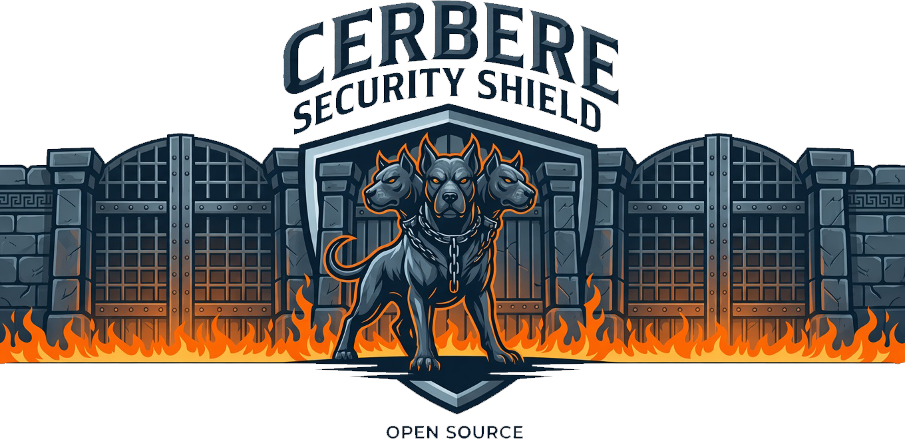

<p align="center">
  
</p>

<p align="center">
  
  
  
  
  
</p>

<p align="center">
  🌐 <a href="https://cerbere-security-shield.art-qalam.fr"><b>Site officiel</b></a> ·
  📖 <a href="docs/QUI-SOMMES-NOUS.md"><b>Qui sommes-nous</b></a> ·
  ⬇️ <a href="https://github.com/art-qalam-fr/CerbereShield/releases"><b>Téléchargements</b></a> ·
  🐛 <a href="https://github.com/art-qalam-fr/CerbereShield/issues"><b>Signaler un bug</b></a>
</p>

---

## 🛡️ Qu'est-ce que Cerbere Security Shield ?

**Cerbere Security Shield** est une suite de sécurité Windows 100 % locale qui vous rend la **visibilité et le contrôle de votre réseau** : chaque port qui écoute, chaque requête DNS qui part, chaque processus qui communique — visible, filtrable et documenté, de façon interactive, sans quitter l'application.

Là où la plupart des bloqueurs fonctionnent en boîte noire, Cerbere vous montre concrètement ce que Windows fait en arrière-plan — télémétrie, suivi commercial, appels inattendus — et vous permet de reprendre la main. Zéro cloud, zéro compte, zéro télémétrie : tout reste sur votre machine.

Le projet est né d'un besoin personnel — voir **[Qui sommes-nous](docs/QUI-SOMMES-NOUS.md)** — et il est distribué en open source pour que chacun puisse inspecter ce qu'il installe.

## ✨ Fonctionnalités

- **📊 Ports & processus en temps réel** — cartographie complète des sockets TCP/UDP, corrélation port ↔ PID ↔ exécutable, score de risque par port et global, inspection SHA-256 + réputation MalwareBazaar (Auth-Key gratuite optionnelle).
- **🚫 Bloqueur DNS multi-listes** — sinkhole local via WinDivert : EasyList, EasyPrivacy, AdGuard, OISD, HaGeZi cochables, whitelist intégrée anti-faux-positifs, autorisation/blocage par domaine en 1 clic.
- **🚨 Détection d'intrusion** — surveillance des journaux Windows (échecs RDP/SMB, scans de ports), bannissement pare-feu persistant, liste blanche d'IP.
- **👨‍👧 Contrôle parental** — PIN dédié, catégories filtrables, fenêtres horaires, quotas journaliers, anti-contournement DoH/VPN.
- **🏠 Contrôle domestique** — verrou des paiements en ligne, audit et purge des cookies navigateurs.
- **💻 Deux interfaces** — dashboard navigateur (localhost:4050) et application desktop Tauri, client systray discret, notifications Windows.
- **🌐 Multilingue** — FR / EN / DE / ES, changement à chaud.

## ⬇️ Installation

### Option 1 — Installeur (recommandé)

Téléchargez **`CerbereShield_Setup.exe`** depuis la [dernière release](https://github.com/art-qalam-fr/CerbereShield/releases/latest) et lancez-le.

> ⚠️ **Version bêta non signée** : Windows SmartScreen affichera un avertissement — *Informations complémentaires → Exécuter quand même*. C'est normal : le code n'est pas encore signé par un certificat. Voir la page [Avertissements](https://cerbere-security-shield.art-qalam.fr/avertissements) pour les détails.

### Option 2 — Portable

Téléchargez **`CerbereShield_portable.zip`**, décompressez, lancez `CerbereShield.exe`. Aucune installation, aucun Python requis.

### Option 3 — Depuis les sources

```powershell
git clone https://github.com/art-qalam-fr/CerbereShield.git && cd CerbereShield
python -m venv .venv ; .\.venv\Scripts\Activate.ps1
pip install -r requirements.txt
.\start_complete_application.bat
```

Prérequis : Windows 10/11 x64, Python 3.12+, droits administrateur (pare-feu, WinDivert).

## 📖 Documentation

| Document | Contenu |
|---|---|
| **[Qui sommes-nous](docs/QUI-SOMMES-NOUS.md)** | Histoire du projet, état d'esprit, open source |
| [Guide bêta-testeur](GUIDE_BETA_TESTEUR.md) | Tester l'application pas à pas |
| [Guide dashboard & systray](docs/web_port_systray_guide.md) | Prise en main des composants |
| [Remerciements & crédits](CREDITS.md) | Plateformes, API et listes de filtrage utilisées |
| [Site officiel](https://cerbere-security-shield.art-qalam.fr) | Présentation, avertissements, sécurité — FR/EN/DE/ES |

## 🤝 Contribuer & signaler

Le projet vit ici : **issues** pour les bugs, **pull requests** bienvenues. C'est le travail d'une seule personne — soyez constructifs et indulgents, chaque retour fait progresser la version.

## ⚠️ Transparence

Cerbere est en **version bêta, en cours de durcissement** (la détection d'intrusion notamment). Il est distribué **en l'état**, gratuitement, sous licence MIT : la sécurité reste l'affaire de tous et l'auteur ne saurait être tenu responsable des failles que le logiciel pourrait encore contenir.

## 📄 Licence

**MIT** — voir [LICENSE](LICENSE). Composants tiers : voir [NOTICE](NOTICE) et [licenses/](licenses/) (WinDivert LGPLv3 — utilisé via liaison dynamique, driver signé officiel non modifié).

---

<p align="center"><i>Un outil de sécurité doit pouvoir être inspecté. Le code est public, auditable, recompilable.</i></p>
