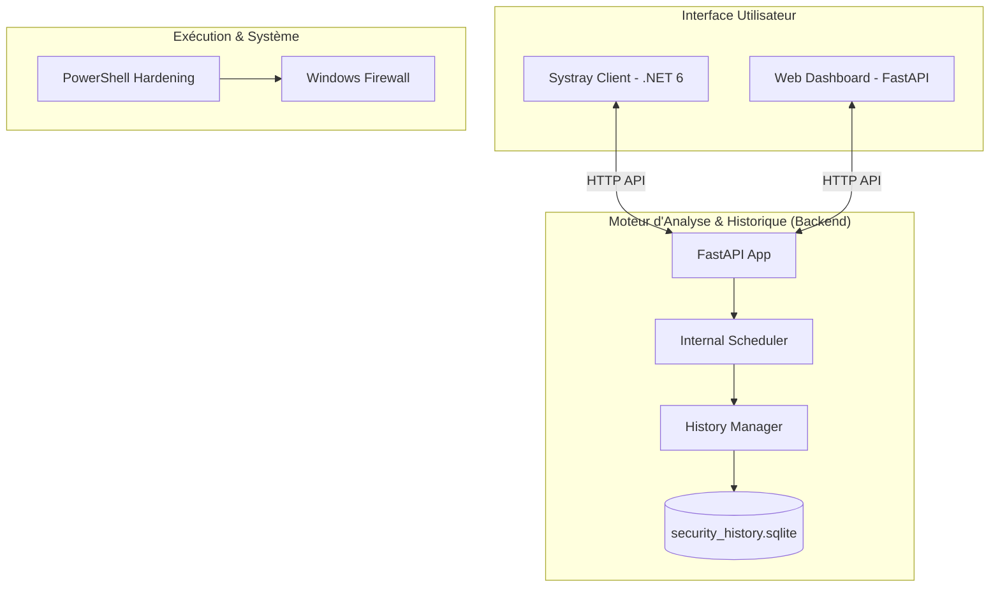

# Manifeste du Projet Cerbere Security Shield
>
> **État des lieux complet et vision stratégique du projet de surveillance et durcissement réseau.**

## 1. Vision et Objectifs

`Cerbere Security Shield` est une solution légère et autonome de **surveillance continue des ports** et de **durcissement réseau (hardening)** pour Windows. L'objectif est de passer d'un audit de sécurité ponctuel à une protection proactive et visible en temps réel.

### Objectifs Principaux

- **Visibilité** : Un tableau de bord web et une icône systray pour connaître l'état des ports à tout moment.
- **Réactivité** : Évaluation automatique du risque (score de 0 à 100) dès qu'un nouveau port est ouvert.
- **Contrôle** : Génération de plans de durcissement semi-automatiques pour bloquer les ports critiques/inattendus via le Firewall Windows.
- **Historisation** : (Interne) Suivi des expositions dans le temps via SQLite locale, sans dépendance externe.

---

## 2. Architecture du Système

Le projet repose sur une architecture modulaire et autonome :

---

## 3. État des Lieux (Implémentation)

### ✅ Implémenté et Fonctionnel

| Composant | État | Description |
| :--- | :--- | :--- |
| **Backend API** | 100% | FastAPI opérationnel (ports, état de protection, sélection, plans). |
| **Collector** | 100% | Scan périodique via `psutil` et `netstat`. |
| **Risk Evaluator** | 100% | Calcul du score de risque et classification (Critique/Inattendu/Autorisé). |
| **Historisation Interne** | 100% | Module SQLite (`history_manager.py`) et Scheduler intégrés au backend. |
| **Web Dashboard** | 90% | UI interactive (Historique UI à venir). |
| **Hardening Engine** | 100% | Script PowerShell robuste avec gestion du Firewall. |
| **Plans JSON** | 100% | Persistance de la configuration et des plans de durcissement. |

### ⚠️ En cours / Partiel

- **Systray Client** : Correction du build `.exe` et de la stabilité (priorité haute).
- **Configuration YAML** : Personnalisation via l'UI en cours de réflexion.

### ❌ À Implémenter / Futur (Roadmap Corrigée)

- **UI Historique & Alertes** : Affichage des données SQLite dans le Dashboard.
- **Système d'Alertes Visuelles** : Notifications Windows natives via le Systray.
- **Installation en Service** : Déploiement via NSSM pour un fonctionnement autonome.

---

## 4. Matrice des Fonctions

| Fonction | Implémentation | Fichier Source |
| :--- | :--- | :--- |
| **Scan des ports** | Python (`psutil`) | `security_audit/collector.py` |
| **Analyse de risque** | Python | `security_audit/analyzer.py` |
| **Historisation SQLite** | Python / SQLite | `web_port_dashboard/history_manager.py` (à venir) |
| **API Web** | FastAPI | `web_port_dashboard/port_dashboard.py` |
| **UI Dashboard** | HTML/JS | `web_port_dashboard/static/index.html` |
| **Contrôle Systray** | C# / .NET 6 | `systray_client/TrayApplication.cs` |
| **Blocage Firewall** | PowerShell | `scripts/powershell/security_hardening.ps1` |

---

## 5. Roadmap de Transition (Exigences Utilisateur)

### 1. Autonomie Totale (Priorité Haute)

- [ ] Supprimer toute dépendance à **n8n** et **Docker**.
- [ ] Créer le module `history_manager.py` (SQLite) pour l'historisation des snapshots.
- [ ] Intégrer un **Scheduler** (asyncio loop) dans `port_dashboard.py`.

### 2. Réparation Systray (Priorité Haute)

- [ ] Diagnostiquer pourquoi le `.exe` n'est pas fonctionnel.
- [ ] Assurer un build Release propre et testé.
- [ ] Intégrer les alertes visuelles dans le Systray.

### 3. Expérience Utilisateur & Service (Priorité Moyenne)

- [ ] Ajouter un onglet "Historique" dans le Dashboard.
- [ ] Créer le script d'installation `install.ps1` (NSSM).

---

## 6. Guide de Démarrage Rapide

1. **Lancer le Dashboard** : `start_web_port_dashboard.bat` (Port 4050).
2. **Lancer le Systray** : Exécuter `systray_client/bin/Release/net6.0-windows/WebPortSystray.exe`.
3. **Appliquer un durcissement** :
   - Sélectionner les ports dans le Dashboard.
   - Cliquer sur "Générer un plan".
   - Copier la commande PowerShell et l'exécuter en Admin.

---
*Document généré le 23/12/2025 par `coding-agent-pro-safe`.*
