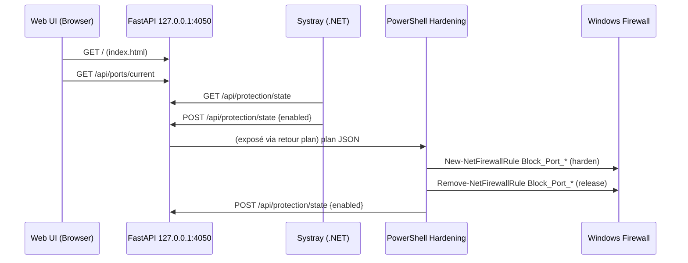
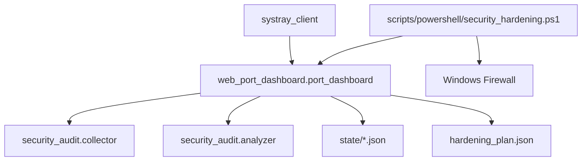

# Documentation Technique — Cerbere Security Shield

## 1. Spécifications Techniques Détaillées

- Projet composé de deux sous‑systèmes principaux:
  - Service web local FastAPI `web_port_dashboard` (port `4050`, host `127.0.0.1`) avec historisation SQLite intégrée.
  - Client systray Windows en C#/.NET WinForms `systray_client` (Correction en cours).
- Scripts PowerShell de durcissement réseau appliquant des règles Firewall et ajustements `netsh`.
- Fichiers d’état et base de données SQLite persistés côté backend (`state/*.json`, `security_history.sqlite`).

### 1.1 Architecture Globale (Mermaid)

```mermaid
flowchart LR
    subgraph Backend[Cerbere Security Shield Backend (FastAPI)]
        API[FastAPI app] --> SA[SecurityAnalyzer]
        API --> NC[NetworkCollector]
        API --> HIST[HistoryManager]
        HIST --> DB[(security_history.sqlite)]
        API --> STATE[`state/protection_state.json`]
    end

    Systray[Systray WinForms .NET 6] -->|HTTP GET/POST| API
    PS[PowerShell Hardening] --> FW[Firewall Rules]
```

Références code:

- FastAPI et endpoints: `web_port_dashboard/port_dashboard.py:219-248`, `web_port_dashboard/port_dashboard.py:300-317`, `web_port_dashboard/port_dashboard.py:361-385`
- Systray client: `systray_client/Program.cs:8-13`, `systray_client/TrayApplication.cs:21-23`, `systray_client/TrayApplication.cs:82-101`
- Hardening PowerShell: `scripts/powershell/security_hardening.ps1:248-275`, `scripts/powershell/security_hardening.ps1:319-431`
- Collecte/Analyse: `security_audit/collector.py:18-57`, `security_audit/analyzer.py:17-49`

### 1.2 Protocoles de Communication, Ports et Endpoints

- HTTP local (FastAPI, Uvicorn):
  - `GET http://127.0.0.1:4050/` page statique dashboard — `web_port_dashboard/port_dashboard.py:361-385`
  - `GET http://127.0.0.1:4050/api/ports/current` snapshot ports/risques — `web_port_dashboard/port_dashboard.py:300-317`
  - `GET|POST http://127.0.0.1:4050/api/protection/state` état global — `web_port_dashboard/port_dashboard.py:219-248`
  - `GET|POST http://127.0.0.1:4050/api/config/selection` sélection ports — `web_port_dashboard/port_dashboard.py:250-273`
  - `POST http://127.0.0.1:4050/api/hardening/plan` génération plan — `web_port_dashboard/port_dashboard.py:319-358`
- Systray client consomme `GET/POST /api/protection/state` — `systray_client/TrayApplication.cs:82-101`, `systray_client/TrayApplication.cs:102-129`
- Scripts PowerShell appellent `POST /api/protection/state` pour sync — `scripts/powershell/security_hardening.ps1:152-161`, `scripts/powershell/security_hardening.ps1:419-421`

### 1.3 Librairies et Frameworks (versions)

- Python (`requirements.txt`):
  - `fastapi` (MIT)
  - `uvicorn[standard]` (BSD-3-Clause)
  - `psutil` (BSD)
  - `pyyaml` (MIT)
- C#/.NET:
  - Target: `net6.0-windows` WinForms — `systray_client/WebPortSystray.csproj:3-6`
- PowerShell: cmdlets `Get-NetFirewallRule`, `New-NetFirewallRule`, `Remove-NetFirewallRule`, `netsh` HTTP

### 1.4 Configuration Système Requise

- OS: Windows 10/11
- Python: 3.10+ (recommandé 3.12+) avec `pip`
- .NET SDK: 6.0 (WindowsDesktop) pour `systray_client`
- Permissions: exécution des scripts avec élévation administrateur pour firewall
- Réseau: localhost `127.0.0.1:4050` exposé pour l’UI et systray

## 2. Inventaire des Composants Logiciels

### 2.1 Dépendances Tierces et Licences

- `fastapi` — MIT
- `uvicorn` — BSD-3-Clause
- `psutil` — BSD
- `PyYAML` — MIT
- .NET WindowsDesktop — licence Microsoft (référentiel .NET SDK)

### 2.2 Mapping des Services Externes

- Aucun service externe cloud; interactions locales uniquement:
  - OS Firewall via PowerShell (`Get/New/Remove-NetFirewallRule`) — `scripts/powershell/security_hardening.ps1:248-275`
  - `netstat` et `netsh` — `security_audit/collector.py:63-86`, `scripts/powershell/security_hardening.ps1:292-301`

### 2.3 Flux de Données (Mermaid)



### 2.4 Matrice des Fonctionnalités

- Core
  - Scan périodique des ports et enrichissement processus — `security_audit/collector.py:136-166`
  - Évaluation du risque et recommandations — `security_audit/analyzer.py:31-49`, `security_audit/analyzer.py:111-146`
  - API de protection et sélection persistantes — `web_port_dashboard/port_dashboard.py:219-273`
  - Génération de plan de durcissement — `web_port_dashboard/port_dashboard.py:319-358`
- Optionnelles
  - Scripts PowerShell dry‑run/apply + logs — `scripts/powershell/security_hardening.ps1:1-23`, `scripts/powershell/security_hardening.ps1:393-398`
  - Systray UI et menu contextuel — `systray_client/TrayApplication.cs:44-52`

### 2.5 Points d’Extension

- Ajout de ports autorisés/critique via YAML `config.yml` — `web_port_dashboard/port_dashboard.py:102-147`
- Extension des règles de hardening (cmdlets, services spécifiques)
- Intégration service Windows via NSSM — `web_port_dashboard/README.md:63-73`

## 3. Documentation Projet Complète

### 3.1 Versioning Semver

- Proposition initiale: `0.1.0` (à formaliser dans `prd/`)
- Historique de changements à consigner dans `docs/` ou `prd/`

### 3.2 Diagramme des Composants



### 3.3 PRD & User Stories

- Objectifs: visibilité des ports, évaluation de risque, durcissement assisté
- User stories:
  - En tant qu’admin, je visualise les ports et leur risque
  - Je génère un plan et applique/annule via PowerShell
  - Je pilote l’état de protection via systray

### 3.4 Manuel Développeur (Build/Test)

- Installer dépendances Python: `pip install -r requirements.txt` — `requirements.txt:1-4`
- Lancer API dev: `python -m web_port_dashboard.port_dashboard` — `web_port_dashboard/README.md:48-53`
- Build systray: `dotnet build -c Release` — `web_port_dashboard/README.md:110-114`
- Scripts hardening: `scripts/powershell/security_hardening.ps1 -DryRun` ou avec `-Plan`

### 3.5 Analyse Git

- Branches/tags: à documenter dans `docs/` (non présent)
- Workspace VS Code: `security_prd.code-workspace`

## 4. Organisation des Livrables

### 4.1 Structure de Fichiers (`f:\Promgramation-teste\security_prd`)

- `web_port_dashboard/` API FastAPI et statiques
- `systray_client/` client WinForms .NET 6
- `security_audit/` modules collecte/analyse
- `scripts/` PowerShell/Python d’exploitation
- `logs/` sortie hardening
- `requirements.txt` dépendances Python

### 4.2 Documentation Visuelle

- Diagrammes Mermaid ci‑dessus intégrés et versionnés dans ce document

### 4.3 Matrice de Compatibilité et Prérequis

- Windows 10/11, admin pour hardening
- Python 3.10+, .NET SDK 6.0
- Port `4050` disponible localement

### 4.4 Checklist Dépendances Critiques

- `fastapi`, `uvicorn`, `psutil`, `pyyaml` installés
- .NET SDK 6.0 présent
- Droits administrateur pour exécuter `security_hardening.ps1`
- NSSM installé si service Windows souhaité

## Intégration & Qualité

### A. Migration des Données

- Fichiers d’état: copier `web_port_dashboard/state/*.json` si déplacement
- Plan de durcissement: `web_port_dashboard/hardening_plan.json`

### B. Tests d’Interopérabilité

- API: tester `GET /api/ports/current`, `GET/POST /api/protection/state`
- Systray: icône change selon `enabled`, actions POST
- Hardening: `-DryRun`, puis `-Plan` pour appliquer/libérer

### C. Points d’Attention UI

- Systray: timeouts courts (3s) — `systray_client/TrayApplication.cs:26-29`
- Affichage état cohérent avec API — `systray_client/TrayApplication.cs:113-122`

### D. Contraintes Techniques

- Détection ports via `netstat` et `psutil`
- Firewall: règles nommées `Block_Port_<PORT>_<PROTO>`
- CORS limité à `localhost` — `web_port_dashboard/port_dashboard.py:33-39`

---

## 5. Modules ajoutés — Contrôle parental &amp; domestique (sept. 2026)

### 5.1 Nouveaux composants

- `parental_control/` : package Python ajouté au backend.
  - `pin_manager.py` : PIN parental 4-8 chiffres (PBKDF2-HMAC-SHA256, 100 000 itérations, sel aléatoire), lockout exponentiel persisté (`state/parental_pin.json`).
  - `rules_engine.py` : décision par domaine — `blocked`, `window` (fenêtres horaires, y compris à cheval sur minuit), `quota` (minutes d'activité DNS, reset à minuit). La règle **la plus restrictive** gagne entre les scopes parental et domestique.
  - `lists_manager.py` : catégories Blocklist Project (adulte, jeux d'argent, drogues, arnaques, malwares, réseaux sociaux) + listes curées locales, cache 24 h avec fail-open.
  - `quota_tracker.py`, `cookies_scanner.py` (audit/purge ciblée Chrome, Edge, Firefox — aucune valeur de cookie lue ni loguée).
- `parental_control/curated/` : `payment_domains.txt` (~140 domaines), `doh_bypass.txt` (60), `vpn_domains.txt` (70).

### 5.2 Sinkhole v2

- `tracker_filter/dns_sinkhole.py` accepte un `rule_resolver` : les règles parentales/domestiques sont évaluées **avant** la whitelist tracker — un domaine interdit par le contrôle parental ne peut pas être contourné via « Autoriser ».
- Le parseur de listes étend chaque entrée `www.domaine` au domaine nu (les deux variantes sont bloquées).

### 5.3 API

- `GET/POST /api/parental/*` et `GET/POST /api/domestic/*` : statut, PIN, règles, journaux, quotas, cookies, `POST .../reset` (réinitialisation complète sous PIN).
- `POST /api/filter/whitelist` : `action` = `add` **ou** `remove` (toggle Autoriser / Re-bloquer).
- `POST /api/filter/whitelist/reset` : vide `custom` + `disabled_defaults`, restaure la whitelist par défaut.
- `POST /api/shutdown` : exige le PIN parental (cookie de session ou PIN dans le corps) quand la protection est active.

### 5.4 UI (dashboard)

- Onglets « Contrôle parental » et « Contrôle domestique » : règles par catégorie/domaine, quotas en direct, journaux de blocage, audit cookies.
- Journaux (filtrage, parental, domestique) : bouton 🔎 (fiche détaillée), 🤖 par ligne (copie pour IA avec feedback « ✓ »), bouton global « 🤖 Tout analyser ».
- Boutons « Autoriser » / « Re-bloquer » (toggle whitelist) et « Réinitialiser DNS » dans l'onglet Filtrage &amp; Trackers.

---

Dernière mise à jour: 24/11/2025
