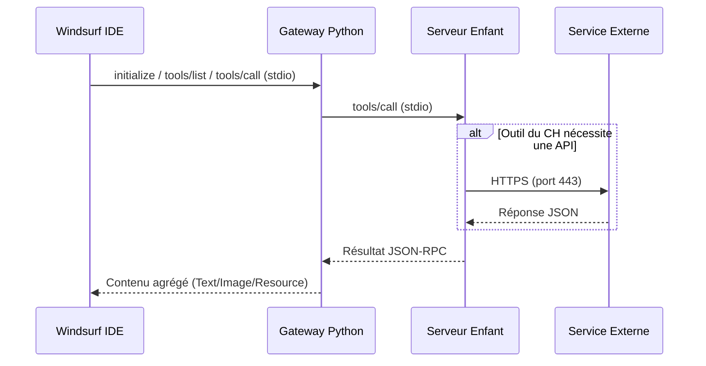
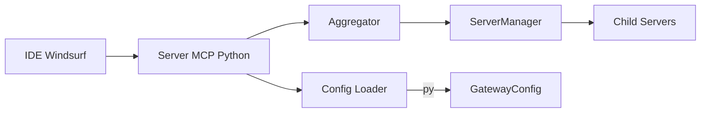

# Documentation Technique Exhaustive — Passerelle MCP Gateway v2

## 1. Spécifications Techniques Détaillées

- Architecture hub-and-spoke (Gateway Python agrège des serveurs MCP enfants)
- Protocole JSON-RPC via stdio entre Gateway et IDE; stdio entre Gateway et serveurs enfants
- Démarrage des serveurs enfants par `subprocess` selon `config.json`
- Caches et minification de réponses côté Gateway

### 1.1 Schéma d’Architecture (Mermaid)

```mermaid
flowchart TB
    IDE[Windsurf IDE] -->|JSON-RPC (stdio)| GW[Gateway Python]
    subgraph Children[Serveurs MCP Enfants]
        FS[filesystem (Node)]
        TM[time-node-mcp (Node)]
        MC[markdownify (Node)]
        MM[mcp-mermaid (Node)]
        PU[puppeteer (Node)]
        GIT[mcp-server-git (uvx)]
        FC[firecrawl (Node)]
        BR[brave-search (Node)]
        C7[context7 (Node)]
        SQL[sqlite-node (Node)]
        MEM[memory (Node)]
        SEQ[sequentialthinking (Node)]
        TSK[task-manager (Python)]
    end
    GW -->|stdio| FS
    GW -->|stdio| TM
    GW -->|stdio| MC
    GW -->|stdio| MM
    GW -->|stdio| PU
    GW -->|stdio| GIT
    GW -->|stdio| FC
    GW -->|stdio| BR
    GW -->|stdio| C7
    GW -->|stdio| SQL
    GW -->|stdio| MEM
    GW -->|stdio| SEQ
    GW -->|stdio| TSK
```

Références code:

- Initialisation et agrégation: `src/main.py:24-60`
- Liste et appel des outils: `src/main.py:64-73`, `src/mcp_aggregator.py:64-102`, `src/mcp_aggregator.py:114-162`
- Gestion des sous‑processus et transport stdio: `src/server_manager_fixed.py:40-72`, `src/server_manager_fixed.py:146-204`, `src/server_manager_fixed.py:272-308`
- Modèle de configuration: `src/config.py:6-15`, `src/config.py:16-30`

### 1.2 Protocoles de Communication, Ports et Endpoints

- Interne Gateway↔IDE: JSON-RPC via stdio (aucun port réseau)
- Interne Gateway↔Serveurs enfants: JSON-RPC via stdio (aucun port réseau)
- Externes (depuis serveurs enfants): HTTPS vers APIs tierces, port 443
  - `n8n` API: `https://les-chients-de-la-casse-du-94.fr/api/v1` (clé API requise)
  - `Brave Search` (clé API requise)
  - `Firecrawl` (clé API requise)
  - `Context7` (clé API requise)

Source: `config.json:119-145`, `config.json:89-118`, `config.json:99-117`, `config.json:109-117`.

### 1.3 Librairies et Frameworks (versions exactes)

- Python (pyproject):
  - `fastmcp==2.11.0`
  - `pydantic>=2.0.0`
  - `anyio>=4.0.0`
  - `python-dotenv>=1.0.0`

Source: `pyproject.toml:1-19`.

### 1.4 Configuration Système Requise

- OS: Windows 10/11 (chemins `F:/`, `C:/` dans `config.json`)
- Python: `>=3.10` (recommandé 3.12+)
- Node.js: 18+ (pour serveurs Node enfants)
- Outils: `uvx` pour `mcp-server-git`
- CPU: 2 cœurs minimum; RAM: 2–4 Go recommandés
- Réseau: sortie HTTPS (port 443) pour services externes

## 2. Inventaire des Composants Logiciels

### 2.1 Dépendances Tierces et Licences

- `pydantic` — MIT
- `python-dotenv` — MIT
- `anyio` — MIT
- `fastmcp` — licence du projet FastMCP (à confirmer)
- Serveurs enfants Node/uvx — licences propres à chaque projet (à confirmer)

### 2.2 Mapping des Services Externes

- `n8n` — URL: `https://les-chients-de-la-casse-du-94.fr/api/v1` — Auth: `N8N_API_KEY`, `N8N_MCP_API_KEY`
- `Brave Search` — Auth: `BRAVE_API_KEY`
- `Firecrawl` — Auth: `FIRECRAWL_API_KEY`
- `Context7` — Auth: `CONTEXT7_API_KEY`

Variables sensibles chargées via `.env` et `os.environ` (masquage recommandé). Source: `src/main.py:10-15`, `src/config.py:24-30`, `check_env.py:1-23`.

### 2.3 Flux de Données (Mermaid Sequence)



### 2.4 Matrice des Fonctionnalités (Core vs Optionnelles)

- Core
  - Agrégation d’outils par serveur (Gateway)
  - Cache et minification côté Gateway
  - Démarrage et surveillance des sous‑processus
- Optionnelles (selon serveurs enfants)
  - Génération de diagrammes (`mcp-mermaid`)
  - Conversion HTML→Markdown (`markdownify`)
  - Automatisation navigateur (`puppeteer`)
  - Recherche (`brave-search`, `firecrawl`, `context7`)
  - Accès fichiers (`filesystem`)
  - Temps/date (`time-node-mcp`)
  - SQLite utilitaires (`sqlite-node`)
  - Mémoire/graph (`memory`, `task-manager`)

### 2.5 Points d’Extension (Hooks, Interfaces)

- Ajout de serveurs via `config.json` (préfixes optionnels) — `src/config.py:6-15`
- Proxies outils agrégés — `src/mcp_aggregator.py:64-102`
- Cache de résultats et minification — `src/server_manager_fixed.py:272-308`, `src/server_manager_fixed.py:371-395`

## 3. Documentation Projet Complète

### 3.1 Versioning Semver et Historique

- Version projet: `0.1.0` (pyproject)
- Règles Semver: MAJOR (ruptures), MINOR (fonctionnalités), PATCH (correctifs)
- Journal de changements: aligné avec docs `documentation/` et métriques `backup/logs/metrics.jsonl`

### 3.2 Diagramme des Composants Clés (Mermaid)



Réfs: `src/main.py:61-83`, `src/mcp_aggregator.py:1-15`, `src/server_manager_fixed.py:310-319`, `src/config.py:16-30`.

### 3.3 PRD Aligné avec User Stories

- Objectifs: agrégation transparente, réduction métadonnées, stabilité stdio
- État: cache simple activé; proxy unique non implémenté; lazy loading non implémenté
- Voir: `backup/documentation/optimization-prd.md`, `backup/documentation/PRD.md`

### 3.4 Manuel Développeur (Build/Test)

- Build
  - `pip install .` (pyproject)
- Lancement
  - `python src/main.py` (ou `run.bat`)
- Configuration
  - `config.json` au projet
  - Vérification: `scripts/diagnostics/verify_config.py`
- Tests/diagnostics
  - `scripts/diagnostics/list_enabled_servers.py`
  - `check_env.py` pour variables (masquées)

### 3.5 Analyse Git

- Branches: convention `main`, `develop`, `feature/*` (à confirmer)
- Tags: semver `vX.Y.Z` (à confirmer)
- CI: `/.github/workflows/ci.yml`

## 4. Organisation des Livrables (security_prd)

### 4.1 Structure de Fichiers Proposée

- `security_prd/`
  - `documentation-technique.md` (ce document)
  - `diagrams/` (export Mermaid si besoin)
  - `checklists/` (dépendances critiques)
  - `compatibility/` (matrices et prérequis)

### 4.2 Documentation Visuelle

- Les diagrammes Mermaid ci‑dessus sont versionnés avec ce document.
- Export PNG/SVG optionnel via `mcp-mermaid`.

### 4.3 Matrice de Compatibilité et Prérequis d’Intégration

- OS: Windows 10/11
- Python: >=3.10; Node 18+; `uvx` installé
- Réseau: HTTPS sortant
- Chemins: vérifier existence des exécutables référencés dans `config.json`
- Variables: fournir clés API via `.env` (ne pas commiter)

### 4.4 Checklist des Dépendances Critiques

- Clés API présentes (`BRAVE_API_KEY`, `FIRECRAWL_API_KEY`, `CONTEXT7_API_KEY`, `N8N_API_KEY`, `N8N_MCP_API_KEY`)
- Binaire `node` et `uvx` accessibles
- Bases SQLite cibles accessibles (si utilisées par `sqlite-node`/`memory`)
- Serveurs enfants présents aux chemins configurés

## Intégration Transparente — Procédures et Contraintes

### A. Procédures de Migration des Données

- Déplacer `MEMORY_FILE_PATH` (si changement): arrêter Gateway, copier le fichier, mettre à jour `config.json`, redémarrer
- Migrer bases SQLite: sauvegarde, copie, vérification chemins (`DEFAULT_DB_PATH`, `N8N_*_DB`)

### B. Tests d’Interopérabilité Requis

- `tools/list` depuis IDE: vérifier visibilité des outils agrégés
- `tools/call` pour chaque serveur: ping simple (ex: `time-node-mcp.get_current_date`)
- Vérifier accès APIs externes (statuts HTTP 200)

### C. Points d’Attention UI

- Nommage des outils: éviter collisions; utiliser `prefix` si nécessaire
- Feedback clair en cas de timeouts; cacher détails sensibles dans logs

### D. Contraintes Techniques Spécifiques

- Transport stdio uniquement (pas de ports réseau internes)
- Timeouts et retries côté Gateway (`server_manager_fixed`)
- Masquage des secrets dans diagnostics (`check_env.py`)

---

Dernière mise à jour: 24/11/2025
